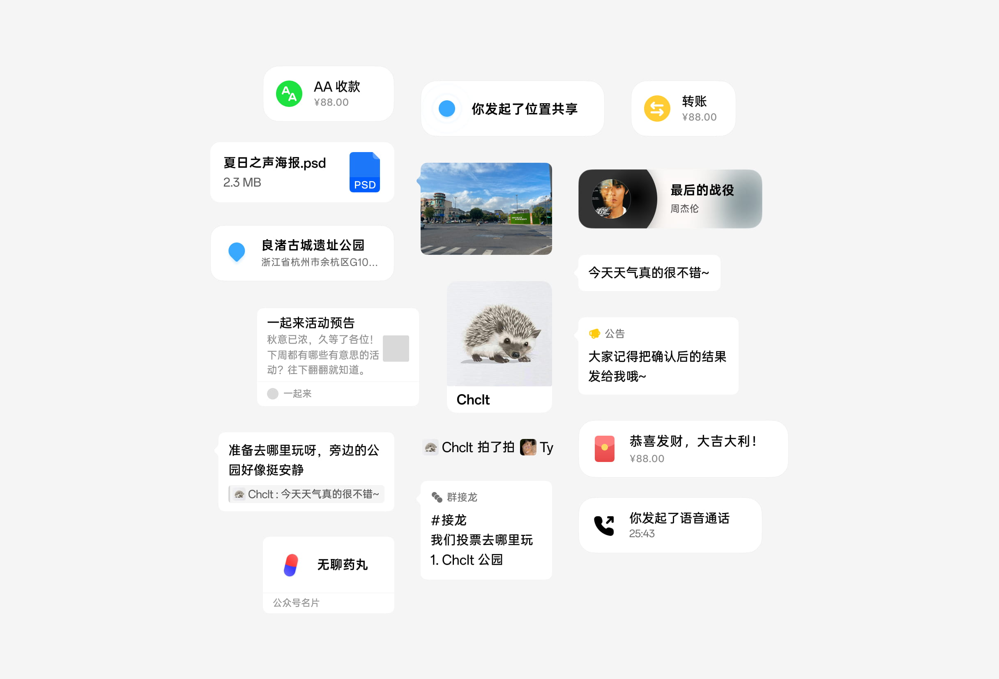
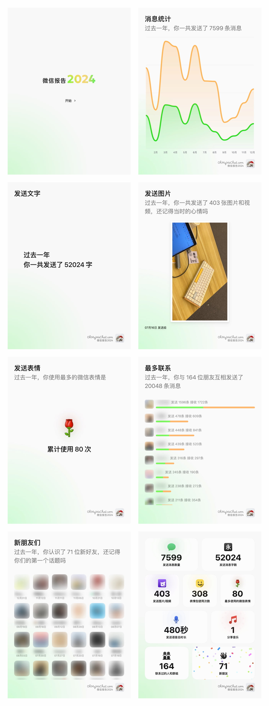
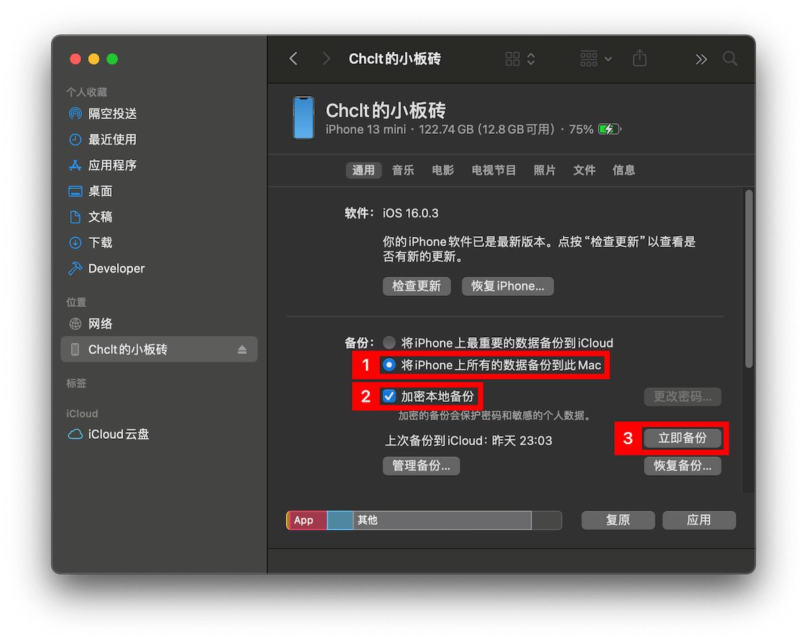

# OhMyWeChat：微信备份阅读器

这是一个为微信设计的备份阅读器，总体上还原了微信，但经过了无数的重新设计，看起来焕然一新~

[在线体验](https://www.ohmywechat.com/)

[关注我的 Telegram 频道](https://t.me/chclt_hi) | [关注我的 Twitter](https://twitter.com/realChclt)

[注意事项](#注意) | [使用说明](#使用说明)

## 注意

- 使用 OhMyWeChat 需要一台 iPhone（或 iPad）以及一台 Windows（或 Mac）操作系统的电脑，电脑负责将手机中的数据导出并展示。
- 所有数据均在本地处理。
- 部分图片资源（如头像等）通过网址从微信自己的服务器获取，如果你介意这一部分请求可能造成的隐私泄露，你可以在备份文件加载完成后断开网络，大部分功能依然能够正常使用。
- 软件在较新版本的 Chrome、Firefox 和 Safari 下开发，但经测试依然无法保证所有功能在所有浏览器中都能正确运行。
- 为了防止可能发生的浏览器插件造成的隐私泄露，建议在无痕模式下打开本软件。
- 务必注意保护好自己的备份文件以及备份密码。

## 已知问题

- [ ] 对于较新版本的微信客户端（大约 8.0.55 及以上），大部分数据无法解析。
- [ ] 暂未支持实况图片。
- [ ] 发送的表情包有概率无法显示。
- [ ] 在发送的笔记消息中，录音文件暂无法播放。

## 特性

- 支持浏览加密的备份文件
- 支持聊天记录搜索
- 支持（几乎）完整的消息类型
  - [x] 文本、图片（见[已知问题](#已知问题)）、视频、语音、回复消息
  - [ ] 表情包（见[已知问题](#已知问题)）
  - [x] 合并转发
  - [x] 笔记（见[已知问题](#已知问题)）
  - [x] 位置、实时位置共享
  - [x] 红包、转账、AA 收款（可用但仍有问题）
  - [x] 分享链接、分享音乐等
  - [x] 通话记录
  - [x] 微信名片、公众号名片、视频号名片、微信小店名片等
  - [x] 群接龙、群公告
  - [x] 拍一拍、系统消息
  - [ ] 礼物（暂不支持，计划中）
  - [x] 等等近 50 种消息类型……

- 熟悉但焕然一新的 UI 界面

  

  

- 

<del>2024 微信年度数据报告</del>（已下线）

  

  

## 使用说明

1. 你需要准备一台 iPhone（或 iPad），以及一台 Windows 或 macOS 的电脑。

2. 连接你的 iPhone / iPad 到电脑后，如果在 Windows 下，第一步是通过苹果官方的 iTunes 备份你的设备到电脑上；如果你使用 Mac，备份设备的功能集成在访达中，你不需要安装任何额外软件。**建议在备份时使用加密备份并设置合适的密码。**

   > 注：并不是使用微信自带的“迁移聊天记录到电脑”的功能，而是使用 Windows 下的 iTunes，或 Mac 下的访达，所以使用 OhMyWeChat 需要一台 iPhone / iPad 和一台 Windows / Mac 电脑。

   

3. 等待备份完成后，你的备份文件应该位于 Windows 下的 `C:\用户\(用户名)\AppData\Roaming\Apple Computer\MobileSync\Backup\` 或 Mac 下的 `~/Library/Application Support/MobileSync/Backup`（在访达中你可以使用快捷键 <kbd>Command</kbd> + <kbd>Shift</kbd> + <kbd>G</kbd> 快速打开这个文件夹），我们需要的文件夹是其中名如 `xxxxxxxx-xxxxxxxxxxxxxxxx` 的那一个（也有部分系统版本产生的是名如 `xxxxxxxxxxxxxxxxxxxxxxxxxxxxxxxxxxxxxxxx` 的文件夹）。

4. 出于安全考虑，浏览器应该不会允许你在网页中直接打开上面这两个文件夹，所以你需要把所需的 `xxxxxxxx-xxxxxxxxxxxxxxxx` 文件夹移动到系统目录以外的地方。

5. 在 OhMyWeChat 中打开刚才准备好的文件夹，并按提示输入备份密码。出于不同浏览器中不同的接口调用，Chrome 浏览器会询问你是否允许网页访问该文件夹，而 Firefox 会询问你是否要上传整个文件夹，请选择允许。事实上 OhMyWeChat 并不会“上传”任何数据，所有数据不会离开本地，这里的“上传”只是浏览器对于网页操作文件的一种广义描述，请放心~
